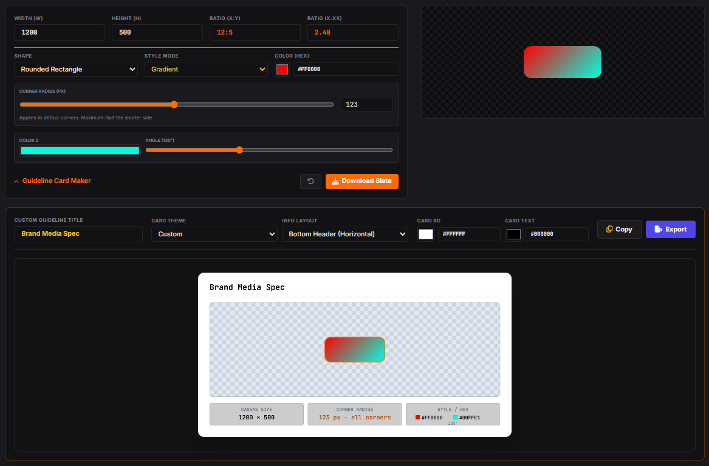
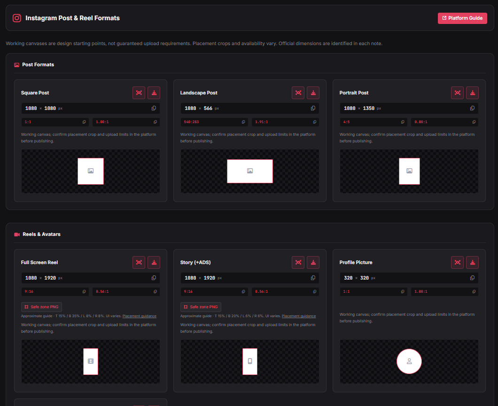

# RESTIO

RESTIO is an open-source, browser-based tool for checking image dimensions, calculating aspect ratios, and creating visual assets for social media, video production, and print.

## Features

- Browse preset dimensions for common media formats.
- Calculate dimensions and aspect ratios.
- Generate downloadable PNG slates with solid colors, gradients, or UV grids.
- Create custom guideline cards.
- Convert paper sizes into pixels at different print resolutions.
- Switch between light and dark themes.

## Supported platforms

Includes design presets for YouTube, Facebook, Instagram, TikTok, X/Twitter, Dribbble, and Behance, plus cinema/video formats and paper sizes for print.

Presets are design starting points. Check each platform’s current guidance for placement, cropping, and upload requirements.

## Preview

### Slate and guideline card maker

### Social platform presets

## Getting started

Download `Restio.html` and open it in your browser. No installation or build process is required. An internet connection is needed to load external styles, icons, and fonts.

**Remark:** This app was created with AI assistance from Gemini and ChatGPT.

Feel free to say hello on Instagram: [@barsaint.post](https://www.instagram.com/barsaint.post/).
